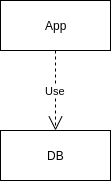
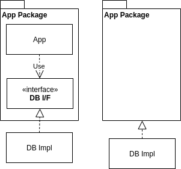
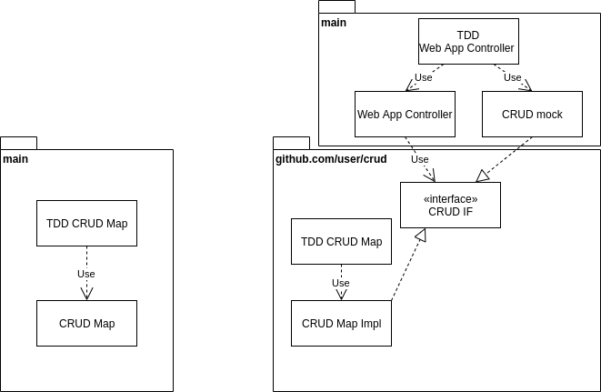
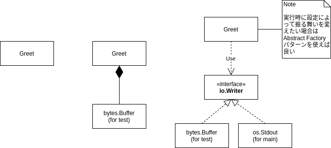

# golang tdd

## tdd

- やりたいことをリストアップ

<以下を繰り返す>

- テストを書く
- テストの実行 (red)
    - コンパイルを通す `go test -v`
    - 動くようにする　(green)
- リファクタ
    - 構造を変える
    - 関数にまとめる
    - IFで定義する
    - 問題点を洗い出す
    - ベンチマークをする
    - コメントを追記する

## interface

- 登場人物は3者
    - IF の定義 `type XX interface { DO()}`
    - IF の使用者 `func (o *Object) UseXX(xx XX) { xx.Do }`
    - IF の実装 `func (i *Impl) Do() { do something }`
- 振る舞いを定義する
- 依存関係の逆転 (DIP) **重要** CLEAN ARCHITECTURE が実現できる
    - 例: `APP -> DB` の関係を `DB -> APP` に変換すること
    - 下記の図を参照





```go
package main

type User string

type App struct {
    user User
}

var db = &DB{imMemoryMap: make(map[string]User)}

// dbに依存して動きが変わる 
// mapを使ったDBの操作になる
func (a App) doSomething() {
    db.AddUser(user)
}

type DB struct {
    imMemoryMap: map[string]User
}

func (d *DB) AddUser(user User) {

    d.imMemoryMap[createId] = user
}

func main {
    ...
}

```

```go
package main

type User string

// 1 IFの定義
type CRUDIf interface {
    AddUser(User)
}

type App struct {
    user User
    // db CRUDIf 埋め込んでしまっても良い
}

// 2 使う人(IFの振る舞いだけは知っている)
// IFの実装を意識しなくても良くなる
func (a App) doSomething(db CRUDIf) {
    db.UserAdd(a.user)
    // a.db.UserAdd(a.user)
}

type MockDB struct {
    imMemoryMap: Map[string]User
}

// 3 IFの実装
func (m *MockDB) UserAdd(user User) {
    m.imMemoryMap[createId] = user
}

func main {
    ...
}
```

## [Map](https://github.com/quii/learn-go-with-tests/blob/master/maps.md)でmapを直接 使用しない理由

- dictionaryを実装する CRUDのIFを先に**実装**しておきたい(実装から振る舞いを決める)
    - ボトムアップ的な考え方
    - 下記の左側の図 (実装の単体テストができる)
        - Web App Controller のテストを別に実施することができる



## [Dependency Injection](https://github.com/quii/learn-go-with-tests/blob/master/dependency-injection.md) でできること

- IF を Injection することで用途に合わせて実装の呼び出し先を変える

```go
var db = &DB{imMemoryMap: make(map[string]User)}

// dbに依存して動きが変わる 
// mapを使ったDBの操作になる
func (a App) doSomething() {
    db.AddUser(user)
}
```
を このようにすることで

```go
// 使う人(IFの振る舞いだけは知っている)
// 利用時に動きが変わる
func (a App) doSomething(db CRUDIf) {
    db.UserAdd(user)
}
```

イメージ (厳密には関数なのでUML図にはなっていないが)


